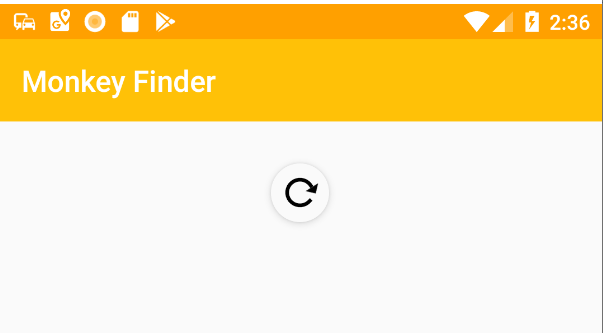

## Adding Pull-to-Refresh

The Xamarin.Forms `ListView` has native support for pull-to-refresh. Additionally, a `RefreshView` has been added in Xamarin.Forms 4.3 that enables developers to add pull-to-refresh to other controls such as ScrollView & CollectionView. Let's use the built-in pull-to-refresh feature of the `ListView`.

Update the `ListView` logic from:

```xml
<ListView ItemsSource="{Binding Monkeys}"
        ItemSelected="ListView_ItemSelected"
        HasUnevenRows="True"
        Grid.ColumnSpan="2">
```

And add the 

```xml
<ListView ItemsSource="{Binding Monkeys}"
        ItemSelected="ListView_ItemSelected"
        HasUnevenRows="True"
        Grid.ColumnSpan="2"
        IsPullToRefreshEnabled="True"
        RefreshCommand="{Binding GetMonkeysCommand}"
        IsRefreshing="{Binding IsBusy, Mode=OneWay}">
```

This will enable pull-to-refresh on iOS & Android:



## ListView Optimizations

### Caching strategy

ListViews are often used to display much more data than fits onscreen. For example, a music app might have a library of songs with thousands of entries. Creating an item for every entry would waste valuable memory and perform poorly. Creating and destroying rows constantly would require the application to instantiate and cleanup objects constantly, which would also perform poorly.

To conserve memory, the native `ListView` equivalents for each platform have built-in features for reusing rows. Only the cells visible on screen are loaded in memory and the **content** is loaded into existing cells. This pattern prevents the application from instantiating thousands of objects, saving time and memory.

Xamarin.Forms permits `ListView` cell reuse through the `ListViewCachingStrategy`, which has the following values:

```csharp
public enum ListViewCachingStrategy
{
    RetainElement,   // the default value
    RecycleElement,
    RecycleElementAndDataTemplate
}
```

#### RetainElement

The `RetainElement` caching strategy specifies that the `ListView` will generate a cell for each item in the list, and is the default `ListView` behavior. It should be used in the following circumstances:

- Each cell has a large number of bindings (20-30+).
- The cell template changes frequently.
- Testing reveals that the `RecycleElement` caching strategy results in a reduced execution speed.


#### RecycleElement

The `RecycleElement`] caching strategy specifies that the `ListView` will attempt to minimize its memory footprint and execution speed by recycling list cells. This mode doesn't always offer a performance improvement, and testing should be performed to determine any improvements. However, it's the preferred choice, and should be used in the following circumstances:

- Each cell has a small to moderate number of bindings.
- Each cell's `BindingContext` defines all of the cell data.
- Each cell is largely similar, with the cell template unchanging.

#### RecycleElement with a DataTemplateSelector

When a `ListView` uses a `DataTemplateSelector` to select a `DataTemplate`, the `RecycleElement` caching strategy does not cache `DataTemplate`s. Instead, a `DataTemplate` is selected for each item of data in the list.

### Using RecycleElement

To optimize performance let's set the following property on the `ListView`

```xml
CachingStrategy="RecycleElement"
```

### Hiding the Separator

By default there is a visible separator between each cell in the `ListView` by setting the `SeparatorVisibility` property we can remove it:

```xml
SeparatorVisibility="None"
```
