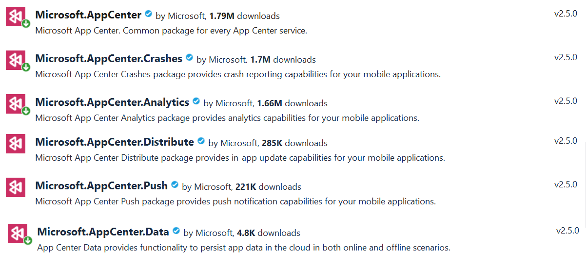

## Part 6 Mobile Backends with Azure

Azure provides every service that any app could need. When it comes to mobile, [App Center](https://appcenter.ms) provides a set of mobile services that started with build, test, and distribution. Now, App Center provides full mobile as a backend services, including analytics, crash reporting, push notifications, authentication, and data! In Part 6 we will integrate the App Center SDK to add analytics and crash reporting. Then we will update our code to synchronize monkeys from the App Center.

### App Center SDKs

App Center provides componentized NuGet packages for each service:



I have already added: Analytics, Crashes, and Data to the project. They just need to be configured in the `App.xaml.cs` file. There you will find the following code to configure App Center for analytics and crash reporting:

```csharp
const string AppCenteriOS = "";
const string AppCenterAndroid = "";

protected override void OnStart()
{
    if (!string.IsNullOrWhiteSpace(AppCenteriOS) && !string.IsNullOrWhiteSpace(AppCenterAndroid))
    {
        AppCenter.Start($"ios={AppCenteriOS};" +
                $"android={AppCenterAndroid}",
                typeof(Analytics), typeof(Crashes), typeof(Data));
    }
}
```


Fill in the following:
```csharp
const string AppCenteriOS = "d0a857ff-843c-458c-90c0-00c24cdccd21";
const string AppCenterAndroid = "9150e8b5-7788-4951-ab5a-260ae099c669";
```

#### Data

I have already setup the App Center account with the data service. Now, we can update our `GetMonkeysAsync` method to call into App Center Data.

First, add the using statement on the top of `MonkeysViewModel.cs`:

```csharp
using Microsoft.AppCenter.Data;
```

Next, we will upgrade the `GetMonkeysAsync` method to call into App Center:

Previously:
```csharp
var json = await Client.GetStringAsync("https://montemagno.com/monkeys.json");
var monkeys =  Monkey.FromJson(json);
```

Now, we can use App Center APIs:

```csharp
var result = await Data.ListAsync<Monkey>(DefaultPartitions.AppDocuments);
var monkeys = result.CurrentPage.Items.Select(m => m.DeserializedValue);
```

Now, run the app and let's get some monkeys from App Center.
